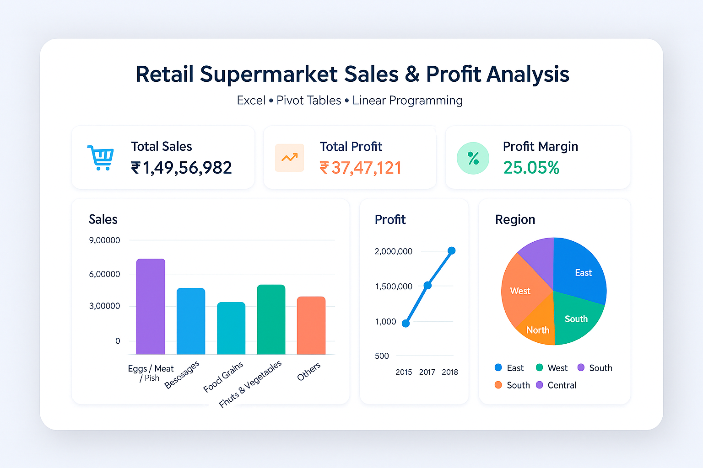

  # Hemant Borana | Aspiring Data Analyst

## 👋 About Me
Final-year BCA student at Amity University Online focusing on Data Analytics. Passionate about transforming raw data into meaningful insights using Python, SQL, and data visualization tools. Seeking opportunities to apply analytical skills to solve real-world business challenges.

🔭 **Currently:** Building expertise in data analysis and visualization  
🌱 **Learning:** Advanced Python for Data Science, Machine Learning fundamentals  
💬 **Ask me about:** Data cleaning, SQL queries, Excel dashboards  
📫 **How to reach me:** hemantpb123@gmail.com  

---

## 🛠 Technical Skills

### Programming & Databases

### Data Visualization

### Tools & Technologies

---

## 📚 Education
- **Bachelor of Computer Applications (BCA)**  
  Amity University Online (2023-2026)  
  Specialization in Data Analytics | CGPA: 7.38 (Semester III)  

- **Higher Secondary (12th)**  
  Dnyanprassarak Mandal's P.V.S. Sarojini Madhusudan Kushe Higher Secondary School  
  Computer Science | Percentage: 71%  

- **Secondary (10th)**  
  Dnyanprassarak Vidyalaya (2021)  
  Percentage: 75%  

---

## 💼 Experience & Internship

### Data Analytics Intern  
**TCS iON** • Remote  
*Jul 2025 – Sep 2025*  

- Participated in **TCS iON RIO-125**, a 125-hour industry internship program focused on retail demand forecasting and data analytics.  
- Developed a **Retail Sales Forecasting System** analyzing 200,000+ records with **99.41% R² accuracy**.
- Worked on forecasting systems and analyzed historical data to predict product demand at retail outlets.  
- Gained hands-on experience with machine learning algorithms including Gradient Boosting for time series forecasting.
- Attended structured webinars and modules focused on real-world retail analytics.  
- **Certified Completion:** Successfully completed the internship with official TCS iON certificate (Cert. ID: 1077-28669565-1016).

**Key Skills:** Data Analytics, Demand Forecasting, Machine Learning, Retail Analytics, Python, Scikit-learn  

---

### Wholesale Distribution & Business Background  
**HREENKAR CREATION** • Mapusa, Goa  
*2021 – Present*  

- Active involvement in **family wholesale garments distribution business** across multiple entities (Hreenkar Creation & Kambeshwar Agencies).  
- Gained **practical B2B commercial experience** and **supply chain analytics exposure**.  
- Hands-on involvement in wholesale operations, brand management, and B2B sales for premium fashion brands.  
- Applied demand forecasting and inventory planning for seasonal and retail trends.  
- Distribution experience with premium brands: **Enamor, Levi's, One8, Lux Cozi, Dixcy Scott**.  
- Developed strong business acumen through **multi-tier distribution channel management**.  

**Key Skills:** Wholesale Distribution, B2B Sales, Brand Management, Inventory Planning, Supply Chain Analytics  

---

# 🚀 Featured Projects

## 💼 Full-Stack Development

### [Distributor Order Management System – with Analytics](https://hemantborana.github.io/D-OMS/)

  

A comprehensive web application designed to streamline distributor operations with integrated analytics. Features include real-time order tracking, inventory management, sales analytics, and automated reporting. Built with responsive design principles to ensure optimal performance across all devices.

**Tech Stack:** `HTML/CSS` `JavaScript` `APIs` `Excel Export`

---

## 🔬 Data Science & Machine Learning

### [Retail Sales Forecasting System - ML](https://github.com/hemantborana/TCS-iON-RIO-Retail-Sales-Forecasting)

  

Advanced machine learning system for retail demand prediction developed during **TCS iON RIO 125 internship**. Analyzed 200,000 records across 4 years (2020-2023) using Gradient Boosting algorithm to achieve **99.41% R² accuracy** and **3.44% MAPE**. Features comprehensive data pipeline from generation to forecasting, seasonal pattern analysis, risk assessment, and business recommendations for inventory optimization and procurement planning.

**Key Features:**
- Advanced ML pipeline with Gradient Boosting algorithm
- Time series analysis with seasonal pattern recognition  
- Risk assessment and business recommendation engine
- Data generation simulation for 4 years of retail data
- Comprehensive performance metrics and visualization

**Tech Stack:** `Python` `Scikit-learn` `Pandas` `NumPy` `Matplotlib` `Seaborn` `Jupyter Notebook` `Gradient Boosting` `Time Series Analysis`

### [Enterprise DMS Sales Report Scraper](https://github.com/hemantborana/enterprise-sales-data-extractor)

  

An automated web scraping solution for extracting and analyzing sales data from enterprise DMS platforms, featuring comprehensive reporting with email notifications and multiple export formats. Successfully deployed in production environments for over 2 months with proven business reliability.

**Key Features:**
- Automated login & navigation using Python Selenium
- Multi-page data handling with robust error handling
- Party-wise data consolidation with target tracking
- Automated email notifications with detailed reports

**Tech Stack:** `Python` `Selenium` `Web Scraping` `Data Analysis` `Automated Reporting` `Email Notifications` `CSV/JSON/PDF Export`

### [HR Attrition Analysis - ML Python](https://github.com/hemantborana/HR-Attrition-Analysis-ML-Python)

  

A comprehensive data analytics and machine learning project focused on understanding employee attrition patterns using Python and Jupyter Notebook. Employed advanced statistical analysis, data visualization techniques, and predictive modeling to analyze 1,470 employee records across 35+ variables.

**Tech Stack:** `Python` `Jupyter Notebook` `pandas` `matplotlib` `seaborn` `plotly` `Machine Learning`

---

## 📊 Business Analytics & Data Visualization

### [Retail Supermarket Sales & Profit Analysis](https://github.com/hemantborana/Retail-Supermarket-Analytics)

  

Comprehensive data analytics project analyzing supermarket sales patterns, profit margins, and customer behavior. Utilized advanced Excel functions, pivot tables, and linear programming optimization to identify trends and provide actionable business insights for revenue optimization.

*Developed as part of the **TCS Course Project** during the **BCA program at Amity University Online***

**Tech Stack:** `Excel` `Data Analysis` `Pivot Tables` `Linear Programming`

### [HR Employee Attrition Analysis - Excel](https://github.com/hemantborana/HR-Employee-Attrition-Analysis)

  

A comprehensive data analytics project focused on understanding employee attrition patterns and predicting workforce turnover using advanced Excel techniques. Analyzed 1,470 employee records across 36 variables to identify key factors contributing to workforce turnover and provide actionable insights for HR decision-making.

**Features:**
- Interactive dashboards with dynamic filtering
- Advanced pivot table analysis
- Regression analysis for predictive insights
- What-if analysis scenarios

**Tech Stack:** `Excel` `Data Analysis` `Pivot Tables` `Regression Analysis` `What-If Analysis`

---

## 🏆 Certifications & Achievements

### TCS iON RIO-125 Remote Internship Certificate

  

**Tata Consultancy Services** • Sept 2025  
**Certificate ID:** 1077-28669565-1016  

- **Project:** Forecasting System - Project Demand of Products at a Retail Outlet Based on Historical Data
- **Duration:** 125 hours of industry-focused training and project work
- **Completion Date:** July 18, 2025 to September 24, 2025
- **Issued By:** Mehul Mehta, Global Delivery Head – TCS iON

**Skills Validated:** Retail Analytics, Demand Forecasting, Machine Learning, Data Analysis, Python Programming
---

  
## 🎯 Project Highlights

| Category | Count | Technologies |
|----------|-------|-------------|
| **Full-Stack Development** | 1 | HTML/CSS, JavaScript, APIs |
| **Data Science & ML** | 3 | Python, Scikit-learn, Selenium, ML |
| **Business Analytics** | 2 | Excel, Data Visualization, Analytics |
| **Total Projects** | **6** | **15+ Technologies** |

---

  <i>💡 Each project demonstrates practical problem-solving skills and real-world application of technology to drive business value.</i>

---

## 🤝 Let's Connect

  
🚀 **I believe in learning through building.** If you're working on a cool data project or want to collaborate—let's connect!

